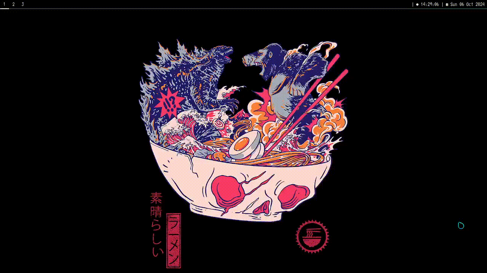

# termenu
terminal dmenu

## Building
~~~sh
git clone https://github.com/asdfish/termenu
cd termenu
sudo make install
~~~

## Usage
~~~sh
$TERM -e termenu_run
~~~

~~~sh
termenu "item 1:item 2:" ":"
~~~

## Showcase

